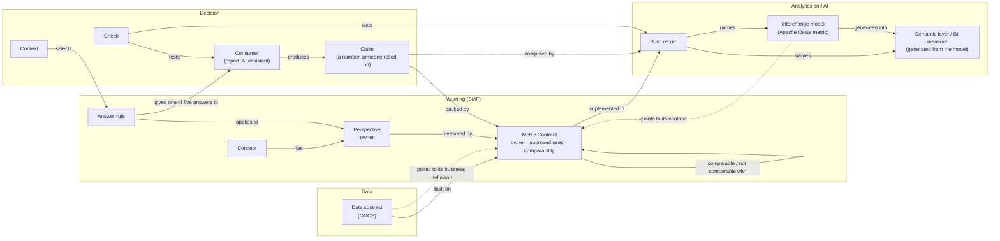

# The Metamodel: A Model of the Models

**Type:** Non-normative

SMF never works alone. A business number rests on a dataset described by a data contract, is computed by a metric in a semantic layer or an interchange model, is used by a report or an AI assistant, and ends up in a decision. Each of those has its own standard, and each standard leaves something to the others.

This page draws that landscape once: the kinds of things each standard produces, and the connections between them. It is a model of the models. Use it to see where SMF sits, which connections it owns, and where the others hand off to it.

## The four columns

| Column | What lives there | Standards and tools |
| --- | --- | --- |
| **Data** | Datasets and the promises made about them | Data contracts (ODCS / ODPS), data platforms |
| **Meaning** | What a term or number means, from which perspective, who decides | SMF: Concepts, Perspectives, Semantic Contracts, answer rules |
| **Analytics and AI** | Where the number is computed and the model that carries it between tools | Semantic layers, BI models, Apache Ossie, metric stores |
| **Decision** | The question asked, the answer given, the number that was relied on | Contexts, consumers (reports, AI assistants), claims and checks |

Meaning is the only column with connections into all three others. That is the whole reason it needs its own discipline.

## The map

Solid lines are connections SMF records. Dotted lines are the same connections recorded from the other side, in the other standard's own file. Where both exist they must agree; neither restates the other.

## The connections, and who owns each

| From | Connection | To | Recorded by | Plain meaning |
| --- | --- | --- | --- | --- |
| Data contract | built on | Metric Contract | SMF (the contract lists its data contracts) and ODCS (the field points to its business definition) | This number stands on these datasets |
| Concept | has | Perspective | SMF | Two things can be true; each has an owner |
| Perspective | measured by | Metric Contract | SMF | This is the agreed number for this perspective |
| Metric Contract | comparable or not comparable with | Metric Contract | SMF | What may and may not be compared or combined |
| Metric Contract | implemented in | Build record | SMF | Where the number is actually calculated, and whether it still matches |
| Build record | names | Interchange model, semantic layer, BI measure, spreadsheet | SMF | The locator inside the tool |
| Interchange model | points to its contract | Metric Contract | Apache Ossie (its extension slot, by convention) | The model says which agreement governs it |
| Interchange model | generated into | Semantic layer or BI measure | SMF (the build record says what it was derived from) | Test the hub once; the spokes are generated |
| Context | selects | Answer rule | SMF | Who is asking, where, for what |
| Answer rule | applies to | Perspective | SMF | Which meaning this situation gets |
| Answer rule | gives one of five answers to | Consumer | SMF | Use it, use the replacement, ask, flag the conflict, not governed |
| Consumer | produces | Claim | SMF | A number someone relied on |
| Claim | backed by | Metric Contract version | SMF | Which agreement, which version |
| Claim | computed by | Build record | SMF, with lineage (OpenLineage) for the run | Which build, which run, which data snapshot |
| Check | tests | Consumer, Build record | SMF | Did it use the right meaning? Does the build still match? |

Technical names for every connection, including the two recorded in other standards' files, are in the [reference](../reference/spec/README.md#relationships-across-standards).

## Two ways to read it

**Right to left is the audit trail of a decision.** The board saw 31%. The claim names the contract version. The contract names the perspective and the owner who signed it. The build record names the metric that computed it. The data contract names the dataset it stood on. Every hop is a card with a standard behind it. When someone asks "why is it that number?", the answer is a person, a date and a decision, and it is already written down.

**Left to right is the operating picture.** Which concepts have perspectives with no owner. Which contracts have no build record. Which builds have drifted from their contract. Which claims rest on an untested build. Each of these is a connection that should exist and does not. The [gap catalogue](gaps.md) lists them.

## What SMF deliberately does not own

The map also shows the hand-offs. SMF does not describe datasets (ODCS does), does not carry the executable calculation (the semantic layer or the Ossie model does), does not record lineage (OpenLineage does), and does not store any of this in a system of its own. Everything in the Meaning column is a file that can live in a repository, a catalog or a shared folder. The connections are the product; the storage is whatever you already have.

That is the boundary with catalogs and governance platforms: they are systems of record for data. The metamodel is a way of reading them, plus one small system of record for meaning.
