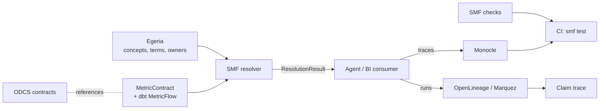

# Reference Pattern: Open-Source Stack

**Type:** Non-normative reference pattern. One way to implement SMF entirely on open projects. None of these components is required.

## Stack

| SMF practice | Open project | Role | Notes |
| --- | --- | --- | --- |
| Modeling, Authority, Lifecycle | **Egeria** (LF AI & Data) | Store concepts, perspectives, terms, contexts, ownership | Map `Term`→glossary term, `Context`→`UsedInContext`, replacement → replacement-term relationship, `Binding`→semantic assignment |
| Discovery | **Amundsen** or **Unity Catalog OSS** (LF AI & Data) | Harvest existing definitions and assets | Feed conflict inventory |
| Measurement | **dbt MetricFlow** or similar | Execute metric contracts | The SMF Metric Contract is the neutral source; bindings point to the executable metric |
| Dataset contracts | **ODCS / ODPS** (Bitol, LF AI & Data) | Dataset-level schema, quality, AI guidance | SMF concepts and metric IDs can be referenced from a contract's AI guidance and synonyms |
| Interchange | **Apache Ossie** | Export portable semantic models | Record what SMF metadata is lost on export |
| Resolution | SMF reference resolver (`reference/tools/smf.py`), or your own | Produce `ResolutionResult` for agents | Can run as a library, a prompt-assembly step or a service |
| Assurance (interpretation) | SMF checks + **Monocle** traces | Check agent behavior against expected states | Capture the agent's resolution in a trace attribute |
| Assurance (claims) | SMF claim traces + **OpenLineage / Marquez** | Link numbers to contract version and run | Candidate: a custom OpenLineage facet carrying `concept`, `measurement` and resolution `state` |
| Consumers | Agent frameworks, e.g. **BeeAI**, **RYOMA** (LF AI & Data) | Use context packages; honor states | Test with golden questions before release |

## Flow

## Candidate upstream contributions

These are proposals to discuss with those communities, not accepted features:

- **OpenLineage custom facet** for semantic context on runs: concept, measurement contract version, resolution state.
- **ODCS extension** for referencing SMF concept IDs and resolution states from a contract's AI guidance.
- **Egeria mapping guide** for storing SMF documents as open metadata.

## Status
Untested as a full stack. Validating it end-to-end is a roadmap item.
